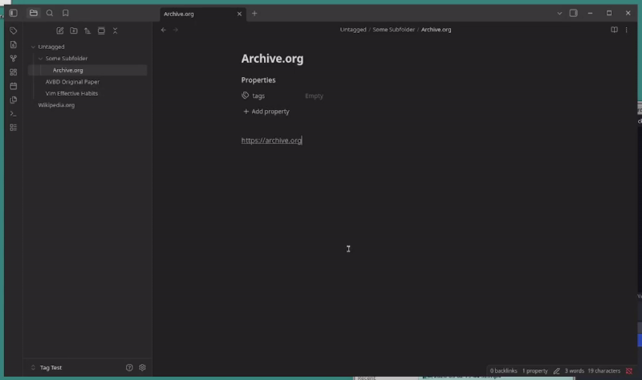
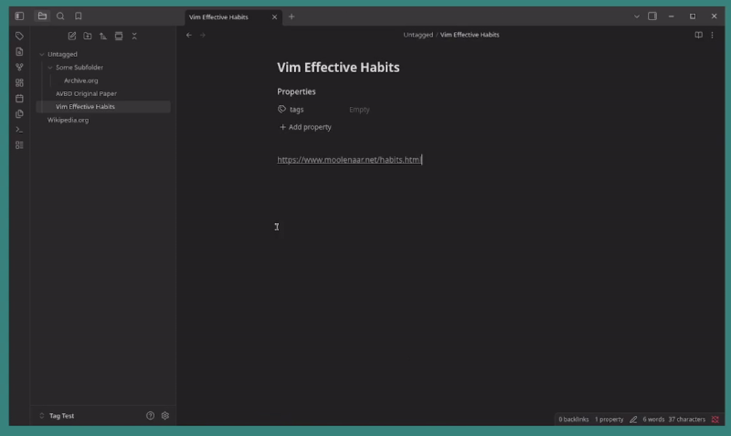
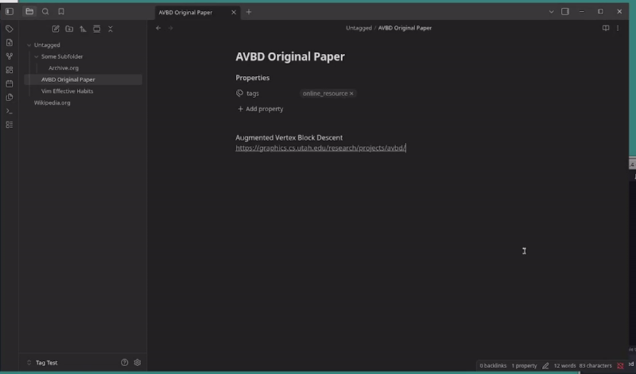

# Tag My Notes AI

Tag notes with your AI model of choice, choose which notes and which tags to consider and customize thought process to your preference.

## Showcase

Quickly create an 'all-tags' operation on the active note

Tag a folder, active note, or all notes from the 'Tag My Notes' pop-up

Settings contains model & params, resoning steps and tag list

## Features

- Choose which tags to apply, and which notes to apply them to
- See tagging progress live as the AI processes each tag for each note
- Tagging operations persist through closing and re-opening of the application
- View, cancel and delete tagging operations
- Customise the AIs train-of-thought to get more accurate results
- Supports the Vercel Gateway, OpenAI and Ollama with custom endpoints

## Usage

In the ribbon on the left, select **Tag My Notes** to open the **Tag My Notes** pop-up.

From the **Tag My Notes** pop-up, you can choose which notes to tag and which tags to apply.

In the context menu (right-click on desktop), select **Apply all tags to note** to quicky tag the active note with all tags without having to open the **Tag My Notes** pop-up.

From the settings menu, add tags and their descriptions, choose an AI model, modify model parameters and even chain of thought.

## Sponsor

Had to buy Vercel credit to test this so consider sponsoring if you find this useful.

## Misc

> [!IMPORTANT]
> This is a powerful tool. Adding more reasoning steps significantly increases token cost and tagging time. For processing a large number of files, it is best to use one reasoning step and to research the best model for your notes. Make sure to keep {description} and {tag} placeholders whenever you change reasoning steps.

> [!NOTE]
> Network use disclaimer, this plugin requires a third party service unless you are self hosting the AI model. Vercel Gateway, OpenAI or Ollama are the available options.

## Attribution

- Uses the JS AI API [here](https://www.npmjs.com/package/ai)
- Uses the libraries [ollama-ai-provider-v2](https://www.npmjs.com/package/ollama-ai-provider-v2) and [@ai-sdk/openai](https://www.npmjs.com/package/@ai-sdk/openai) when not using the Vercel Gateway
